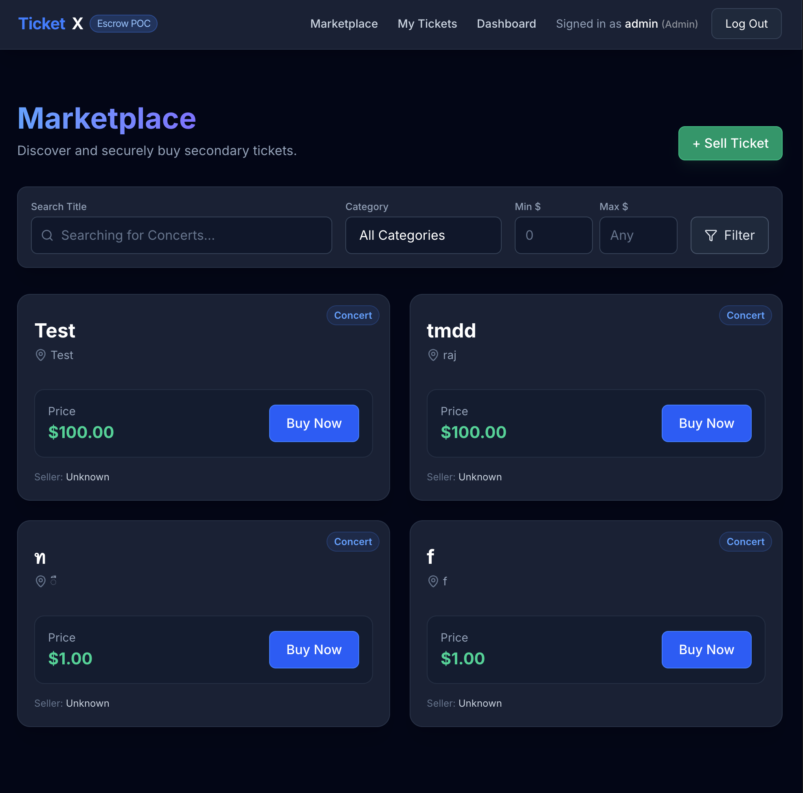
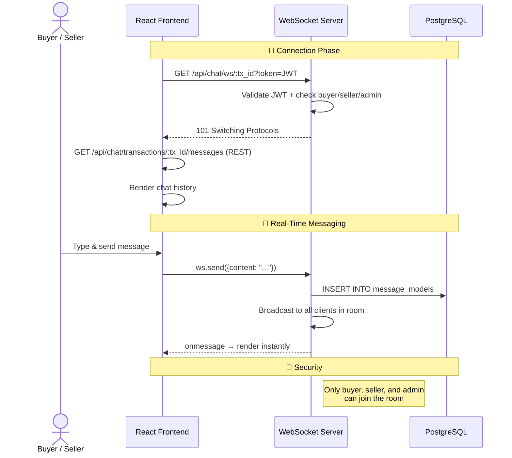
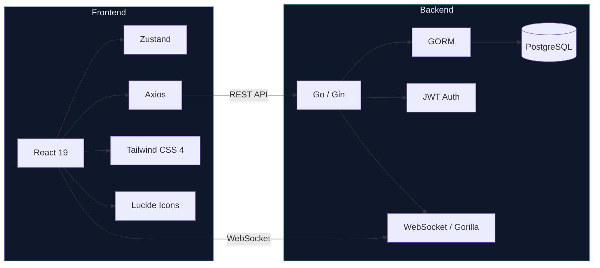
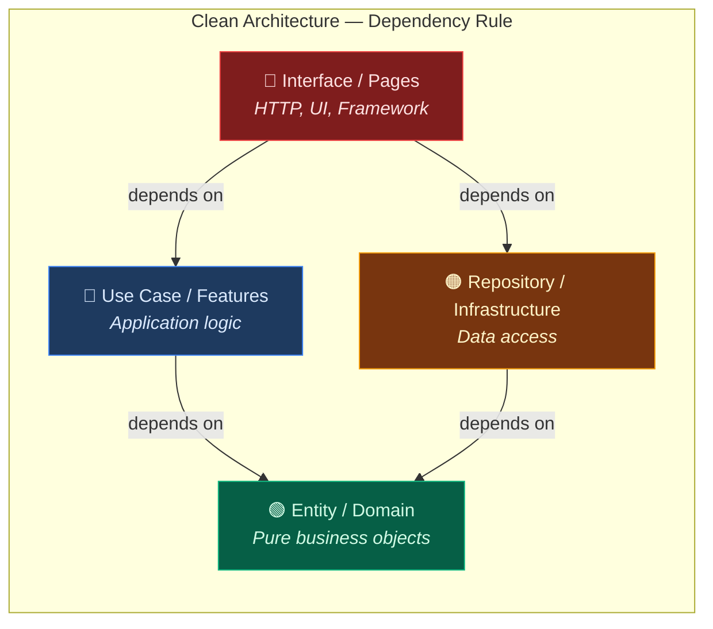
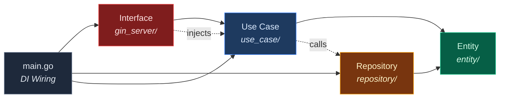
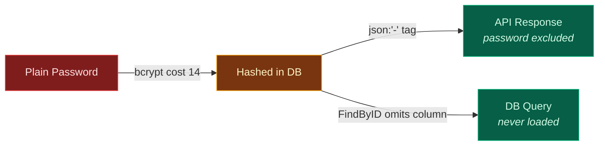
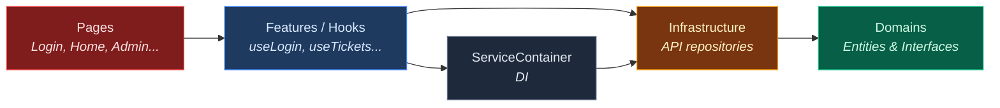
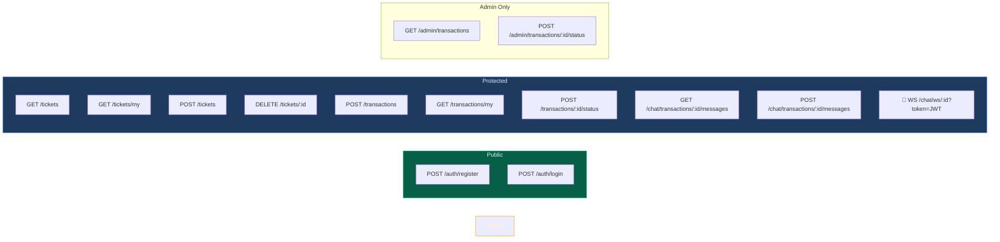

<p align="center">
  <h1 align="center">🎫 TicketX — Secure Secondary Ticket Marketplace</h1>
  <p align="center">
    A Proof-of-Concept escrow-based ticket exchange with <strong>Clean Architecture</strong> on both Backend (Go) and Frontend (React).
  </p>
  <p align="center">
    
    
    
    
    
  </p>
</p>

---

## Screenshots

> Add your own screenshots here! Run the app and capture the UI.

| Marketplace | Escrow Transaction | Admin Dashboard |
|:-----------:|:------------------:|:---------------:|
|  |  |  |

<details>
<summary>📸 How to add screenshots</summary>

1. Create a `docs/screenshots/` folder
2. Take screenshots of each page
3. Save them as `marketplace.png`, `transaction.png`, `admin.png`
4. They will automatically appear in this table

</details>

---

## Core Mechanism — Escrow Flow

```mermaid
sequenceDiagram
    actor Buyer
    actor Seller
    participant Platform as 🛡️ TicketX Platform
    participant Admin as 👮 Admin (Escrow)

    Seller->>Platform: List ticket for sale
    Buyer->>Platform: Click "Buy Now"
    Platform->>Admin: Create escrow transaction

    rect rgb(30, 41, 59)
        Note over Buyer,Admin: 🔒 Escrow Phase — Funds & Tickets held by Admin
        Seller->>Admin: Upload digital ticket
        Admin-->>Seller: ✅ Ticket received & held
        Buyer->>Admin: Upload payment proof
        Admin-->>Buyer: ✅ Payment verified
    end

    Admin->>Buyer: 🎫 Release ticket
    Admin->>Seller: 💰 Release funds
    Note over Buyer,Seller: ❌ Direct Buyer↔Seller chat blocked (prevents off-platform deals)
```



---

## Real-Time Chat — WebSocket Architecture

Each escrow transaction has a private chat room. Communication flows through WebSocket for real-time delivery, with REST fallback for message history.



**Key Design:**
- **Hub pattern** — one Hub manages all rooms (`tx:<id>`), rooms are created/destroyed lazily
- **History via REST** — `GET /api/chat/transactions/:tx_id/messages` loads past messages on page load
- **New messages via WS** — sent through WebSocket, persisted to DB, then broadcast to all room participants
- **Auth** — JWT token passed as query param on WS upgrade (browsers can't set headers on WebSocket)

---

## Tech Stack



---

## Quick Start

### 1. Database (Docker)
```bash
# Option A: Quick start (hardcoded values)
docker run --name ticketx-postgres \
  -e POSTGRES_USER=ticketx_user \
  -e POSTGRES_PASSWORD=secret_password \
  -e POSTGRES_DB=ticketx_db \
  -p 5432:5432 -d postgres:alpine

# Option B: Load from .env (recommended — single source of truth)
cd backend && cp .env.example .env   # edit .env if needed
source .env
docker run --name ticketx-postgres \
  -e POSTGRES_USER=$DB_USER \
  -e POSTGRES_PASSWORD=$DB_PASSWORD \
  -e POSTGRES_DB=$DB_NAME \
  -p $DB_PORT:5432 -d postgres:alpine
```

### 2. Backend
```bash
cd backend
cp .env.example .env    # Never commit this!
go mod download
go run cmd/api/main.go  # → http://localhost:8080
```

### 3. Frontend
```bash
cd frontend
bun install             # or npm install
bun run dev             # → http://localhost:5173
```

---

## Architecture Overview

Both backend and frontend follow **Clean Architecture** — inner layers never depend on outer layers.



---

## Backend Architecture (Go)

### Why `cmd/api/main.go`?

Follows the **Go community standard** project layout. Entry points live under `cmd/` to support multiple binaries (`api`, `worker`, `migrate`). `main.go` is purely a wiring point — DI only.

### 4-Layer Structure



```
backend/
├── cmd/api/main.go                  # Entry point — DI wiring only
├── internal/
│   ├── entity/                      # Layer 1: Domain models & interfaces
│   │   ├── user/                    #   Pure business objects, no framework imports
│   │   ├── ticket/
│   │   ├── transaction/
│   │   └── message/
│   ├── use_case/                    # Layer 2: Business logic
│   │   ├── auth.go                  #   Orchestrates entities & repositories
│   │   ├── ticket.go                #   Knows WHAT to do, not HOW
│   │   └── transaction.go
│   ├── repository/                  # Layer 3: Data access
│   │   ├── user_repository/         #   Implements interfaces from inner layers
│   │   ├── ticket_repository/       #   Contains GORM/DB-specific code
│   │   ├── transaction_repository/
│   │   └── message_repository/
│   └── interface/                   # Layer 4: HTTP handlers & routing
│       └── gin_server/              #   Maps HTTP ↔ Use Case
│           ├── handler_auth.go
│           ├── handler_ticket.go
│           └── middleware/
└── pkg/utils/                       # Shared utilities (JWT, bcrypt)
```

### Password Security (Defense in Depth)



| Layer | Protection |
|-------|-----------|
| `bcrypt` cost 14 | ~1s per hash, brute force resistant |
| `json:"-"` tag | Password hash never serialized to JSON |
| `FindByID()` omits password | DB query excludes the password column |

---

## Frontend Architecture (React)

### 4-Layer Structure



```
frontend/src/
├── domains/                         # Layer 1: Domain (innermost)
│   ├── auth/
│   │   ├── entities/User.ts         #   Pure TypeScript interfaces
│   │   └── repositories/AuthRepository.ts
│   ├── ticket/
│   │   ├── entities/Ticket.ts
│   │   └── repositories/TicketRepository.ts
│   ├── transaction/
│   │   ├── entities/Transaction.ts
│   │   └── repositories/TransactionRepository.ts
│   └── chat/
│       ├── entities/Message.ts
│       └── repositories/ChatRepository.ts
├── infrastructure/                  # Layer 2: Infrastructure
│   ├── api/
│   │   ├── apiClient.ts             #   Axios instance + JWT interceptor
│   │   ├── authRepository.ts        #   Implements IAuthRepository
│   │   ├── ticketRepository.ts
│   │   ├── transactionRepository.ts
│   │   └── chatRepository.ts        #   WebSocket implementation
│   └── services/
│       └── ServiceContainer.ts      #   DI container
├── features/                        # Layer 3: Features (hooks)
│   ├── auth/hooks/useLogin.ts
│   ├── ticket/hooks/useTickets.ts
│   ├── transaction/hooks/useTransaction.ts
│   └── chat/hooks/useChat.ts
├── pages/                           # Layer 4: Presentation (outermost)
├── components/                      # Shared UI components
├── store/                           # Zustand (auth state only)
└── App.tsx                          # Router + Layout
```

### Key Design Decisions
- **Domains** = pure TypeScript interfaces only. No React, no Axios, no framework code
- **Infrastructure** implements domain interfaces with real HTTP/WebSocket
- **ServiceContainer** = DI container. Swap implementations without touching features
- **Features** expose custom hooks. Pages stay thin (UI only)
- **Zustand** handles only auth state. Domain state lives in hooks

---

## API Endpoints



---

## Security Considerations

*   **Credentials**: Do not commit `DB_PASSWORD` or `JWT_SECRET`. They are managed via `.env` and ignored by `.gitignore`.
*   **Authentication**: All sensitive endpoints and WebSockets are guarded by JWT tokens.
*   **Passwords**: Hashed with `bcrypt` (cost 14) before storage. Never exposed in API responses (see Defense in Depth above).
*   **HTTPS**: Plaintext password transmission is safe over TLS — this is the industry standard used by all major platforms.

---

<p align="center">
  Built with ❤️ as a learning project for <strong>Clean Architecture</strong> + <strong>Escrow Systems</strong>
</p>
